<div align="center">

# 🌾 KisanBandhu
### Multilingual AI Farming Advisory Chatbot

**Scientific crop guidance, in your language, powered by a local LLM on your own laptop.**


*No OpenAI keys. No Gemini keys. Retrieval and generation run 100% locally — just farmers getting answers.*

</div>

---

## 🎯 The Problem

Built as part of a **contract farming initiative**, where farmers are expected to follow precise, buyer-mandated agricultural standards — exact dosages, spacing guidelines, pesticide schedules — to meet quality requirements. These standards typically live in dense English-language PDF manuals, making them slow to consult and hard to act on in the field. **KisanBandhu closes that gap**, turning static manuals into a conversational advisor that gives farmers instant, precise answers in their own language.

---

## 🌟 Key Highlights *(For Recruiters)*

<table>
<tr>
<td width="50%" valign="top">

### 🌐 Cross-Lingual RAG
Farmers query in **Hindi or Marathi**. The system:
1. Translates the query → English
2. Retrieves from the English PDF knowledge base
3. Generates a precise answer
4. Translates the response back to the farmer's language

</td>
<td width="50%" valign="top">

### 🔍 Hybrid Semantic + Keyword Search
- **FAISS** (dense vectors) → conceptual understanding
- **BM25** (sparse keywords) → exact numbers, pesticide names, crop values

Best of both worlds — no missed matches on precise terms.

</td>
</tr>
<tr>
<td width="50%" valign="top">

### 🎯 Dynamic Context Routing
Automatically extracts the target crop/plant noun from a query to **boost relevant content** (e.g., Mango guidelines) and **penalize unrelated crops** (e.g., Wheat guidelines) — no cross-context confusion.

</td>
<td width="50%" valign="top">

### ⚡ Local CPU Execution
Retrieval and answer generation — powered by `flan-t5-base` + `all-MiniLM-L6-v2` — run **entirely on-device**, with PyTorch thread pooling delivering detailed answers in **under 4 seconds** on average CPU hardware. *(Note: the Hindi/Marathi translation step currently uses `deep-translator`'s online backend; see "Offline Status" below.)*

</td>
</tr>
</table>

---

## 🧠 How a Query Flows

```mermaid
flowchart LR
    A["🗣️ Farmer asks<br/>in Hindi/Marathi"] --> B["🌐 Translate<br/>to English"]
    B --> C["🎯 Extract crop/topic<br/>context"]
    C --> D["🔍 Hybrid Search<br/>FAISS + BM25"]
    D --> E["🧩 Retrieve relevant<br/>PDF chunks"]
    E --> F["🤖 flan-t5-base<br/>generates answer"]
    F --> G["🌐 Translate back<br/>to farmer's language"]
    G --> H["✅ Answer delivered<br/>in <4 seconds"]

    style A fill:#FFF3C4,stroke:#D4A017
    style H fill:#FFF3C4,stroke:#D4A017
    style D fill:#FFE58A,stroke:#D4A017
    style F fill:#FFE58A,stroke:#D4A017
```



---

## 📡 Offline Status

| Component | Runs Offline? |
|---|:---:|
| Embeddings (`all-MiniLM-L6-v2`) | ✅ |
| Hybrid Search (FAISS + BM25) | ✅ |
| Answer Generation (`flan-t5-base`) | ✅ |
| Hindi/Marathi Translation (`deep-translator`) | ⚠️ Requires internet (uses an online translation backend) |

The core RAG pipeline — retrieval and generation — runs entirely on-device with zero API costs. The multilingual layer currently depends on an online translation service; swapping in a fully local translator (e.g. Argos Translate or IndicTrans2) is on the roadmap to make the entire pipeline offline end-to-end.

---

## 🛠️ Tech Stack

| Layer | Technology |
|---|---|
| **Backend** | Python · Flask · PyTorch |
| **AI & NLP** | `transformers` · `sentence-transformers` · `faiss-cpu` · `deep-translator` |
| **Frontend** | Vanilla HTML5 · CSS3 (Glassmorphism) · JavaScript (Fetch API) |
| **Models** | `google/flan-t5-base` (generation) · `all-MiniLM-L6-v2` (embeddings) |

---

## 📂 Project Architecture

```
├── app.py                # Flask Web Server & Gen-AI routing
├── hybrid_search.py      # Custom BM25 + FAISS Hybrid Searcher
├── rag_pipeline.py       # Document chunking & FAISS index builder
├── kisanbandhu_ui.html   # Main Web Interface (served at /)
├── data/                 # Folder containing scientific agricultural PDFs
└── faiss_index/          # Local vector database storage
```

---

## 🚀 How to Run Locally

**1️⃣ Clone the repository**
```bash
git clone https://github.com/Shreya10110/kissanbhandu_chatbot.git
cd kissanbhandu_chatbot
```

**2️⃣ Install dependencies**
```bash
pip install flask flask-cors sentence-transformers faiss-cpu transformers torch deep-translator pypdf
```

**3️⃣ Build the vector index**

Place your agricultural PDFs inside the `data/` folder, then run:
```bash
python rag_pipeline.py
```

**4️⃣ Start the application**
```bash
python app.py
```

Open **`http://127.0.0.1:5000`** in your browser and start chatting! 🌾

---

<div align="center">

*Built to make scientific farming knowledge one question away — in the language farmers actually speak.*

</div>
